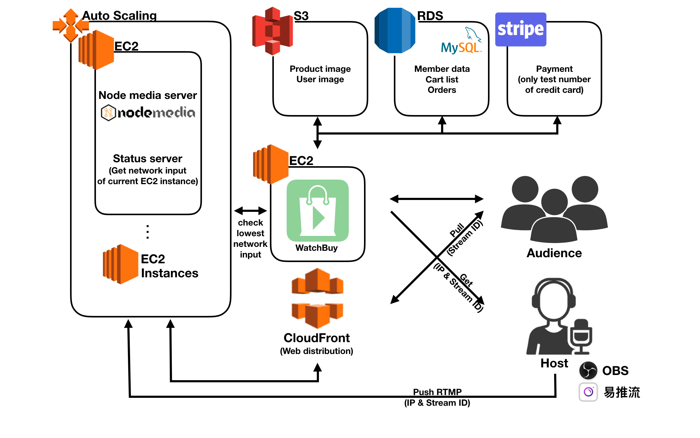
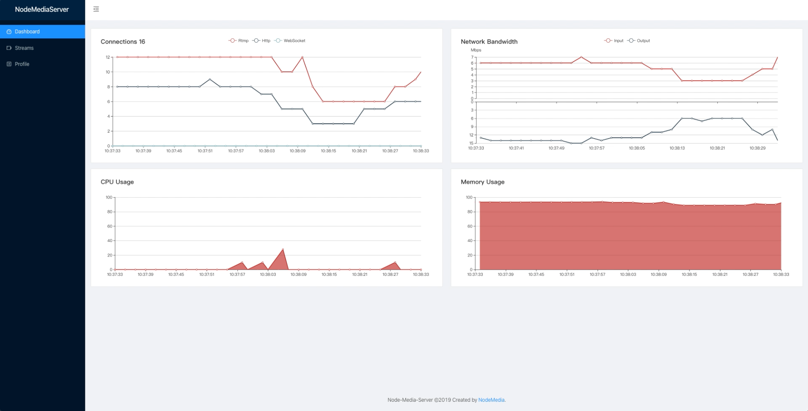

# WatchBuy - Shopping with live video stream

[WatchBuy](https://hzctony.com/) is a shopping website with live video streams. Hosts can introduce products through live videos and share their own live rooms to the audience. If the audience is interested in any products, just add them to cart and go to pay for them.

[See demo video of live view on Youtube](https://youtu.be/HZEDPOzgSJk)
## features
1. hosts can get their assigned IP address and stream ID in profile page for pushing their own video.
2. Users can ask questions by sending instant messages in chat view.
3. User can add product to cart and pay for them through Stripe. Now only for test numbers like below:
    * credit card: 4242 4242 4242 4242
    * Expire: 42/42
    * CVV/CVC NUMBER : 424

---------------------------------------
## Architecture

### features
1. Server scalibility for pushing live streams through Auto Scaling. It's important for balancing load of multiple live streams from differnt hosts. Currently, I activated only 2 ec2 instances which type is t2.micro under my auto scaling for testing.
2. High availabilty of pulling live stream massively through CloudFront with unique cache behaviours to users. Here are some tips about getting dynamic content from CloudFront:
    * In my case, every unique pattern path should be : `<EC2 instance ID>*.flv`. In addition, '*' in the path equals to any Stream ID owned by host. One cache behavior matchs one public IP of an ec2 instance. It helps CloudFront find out the right server under Auto Scaling with specific streams from hosts owing to the 'first match' mechanism of cache behavior.
    * For caching dynamic content, TTL should be set to 0 second. CloudFront will still check cache content through GET request with 'If-modified-Since' header. See more descriptions about TTL on AWS document: [Amazon CloudFront – Support for Dynamic Content](https://aws.amazon.com/tw/blogs/aws/amazon-cloudfront-support-for-dynamic-content/). 

3. Customized load balancer as an API to detect which ec2 instance has the lowest network input and return back the ip address to the hosts. Here are some tips:
    * Created a node.js server, called Status server, in every EC2 instance under Auto Scaling. It calculated the difference of rx_types(received bytes) between seconds after receiving requests.
    * Every time hosts check their own profile page on WatchBuy, the WatchBuy server will get all IPs of running EC2 instances by 'aws-sdk' and send GET requests to all Status servers under Auto Scaling by 'request-promise' and Promise.all to check which is the one with the lowest network input.

4. Used RTMP to push video stream and HTTP-FLV to pull video stream, which is based on the open source: [Node Media Server](https://github.com/illuspas/Node-Media-Server.git). It is great for high interaction between host and audience with very low latency(around 2~5 seconds).

### Future work

Every time Auto Scaling generated a new EC2 instance, execute a .sh file to update new EC2 origin and cache behavior to CloudFront distribution. The approximate steps like below:
* Set specific user info got from IAM to 'aws-sdk'
* Use 'getDistributionConfig' to get all current CloudFront settings.
* Use 'describeInstances' to get all running ec2 instances and add them to config.
* Use 'updateDistribution' to set the modified config.
* Now CloudFront can get streaming data from all the running ec2 instances.
---------------------------------------

## Result of Testing around 20 people online shown on dashboard
This test is going to see the changing of network traffic with around 20 people in a t2.micro EC2 instance. 

[Demo Video about the dynamic charts](https://youtu.be/5Snbt_aPUms)

As shown on dashboard, network input is proportional to the number of hosts. In contrast, network output is proportional to the number of users.  There is an apparent change when hosts push their video to server. On the other hand, the data of rx_bytes(received bytes) is easy to get from system folder. I can compare the rx_bytes/s between servers to provide the IP address of lowest network input to host.

This dashboard is made by [Node Media Server](https://github.com/illuspas/Node-Media-Server.git)

---------------------------------------
## Mysql schema
My database is MySQL which is built on my RDS. Here is my tables:

### Main features
1. Saved unique stream token and ec2 instance ID for every host in hostlist
2. Saved login expire date of hosts and users in hostlist and userlist
3. Saved every single product owned by hosts in products table
4. Saved orders, products in cart for users in orderlist and cartlist
5. Set Transaction to every mysql query except reading data

---------------------------------------

## Prerequeisite

### Languages
* JavaScript 
* HTML5 
* CSS

### Framwork

* Node.js / express

### AWS

* EC2 
* S3
* RDS 
* Auto Scaling

### Database

* MySQL

### main NPM modules

* crypto
* aws-sdk
* request-promise
* MySQL
* Stripe

### Media Server

* [Node Media Server](https://github.com/illuspas/Node-Media-Server.git)

### video player
* [flv.js](https://github.com/bilibili/flv.js.git)

---------------------------------------

## Contact

I am Tony. If you hava any questions, don't be hesitate to share your ideas to me: hzc1033@smail.nchu.edu.tw