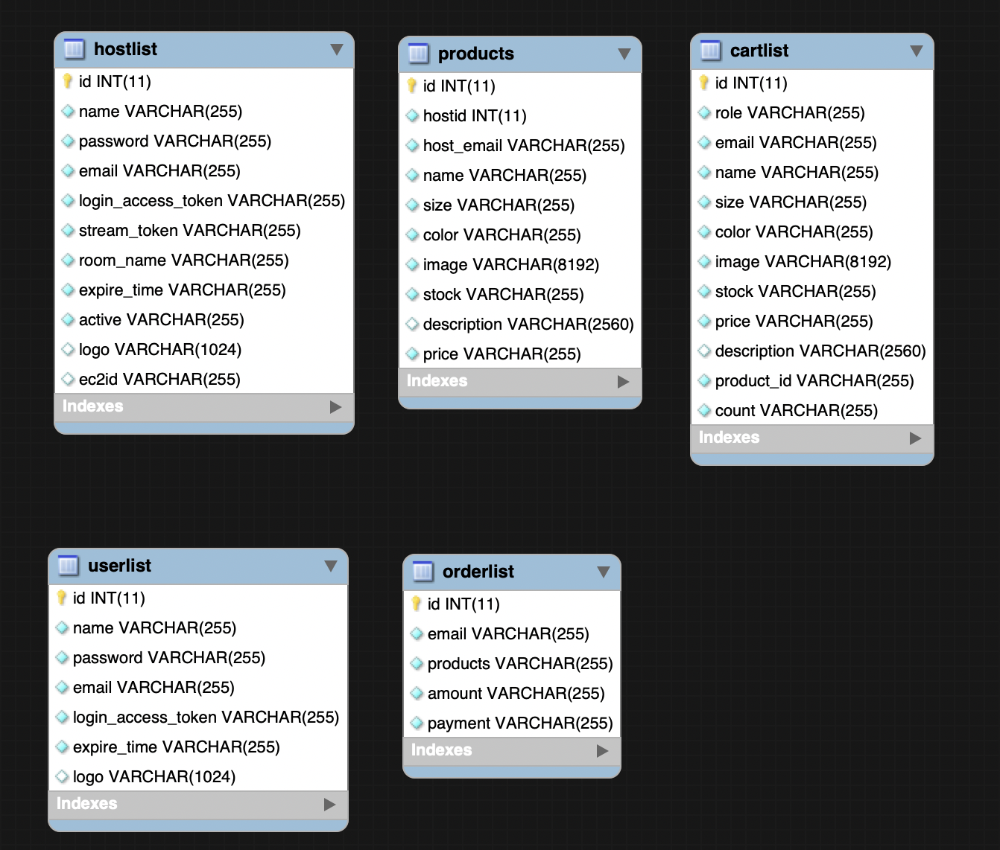

# WatchBuy - Live video shopping
[WatchBuy Website](https://hzctony.com/)

[see demo video on Youtube](https://youtu.be/HZEDPOzgSJk)
## features
1. Every live host can introduce every product in live video.
2. Every user can ask questions through chat view.
3. User can add product to cart and purchase them through Stripe.  ( now only for test: 
 credit card: 4242 4242 4242 4242
 Expire: 42/42
 CVV/CVC NUMBER : 424
 )

---------------------------------------
## Architecture

### features
1. Server scalibility for pushing live stream through Auto Scaling to hosts.
2. High availabilty of pulling live stream massively through CloudFront with unique cache behaviours to users.
3. Customized load balancer as an API to detect which network input of server is the lowest and return back the ip to the hosts.
4. Used RTMP to push video stream and HTTP-FLV to pull video stream
5. Video latency is around 2 ~ 5 seconds.
---------------------------------------

## Mysql schema

### features
1. Saved unique stream token for every host in hostlist
2. Saved login expire date of hosts and users in hostlist and userlist
3. Saved every single product owned by hosts in products table
4. Saved orders, products in cart for users in orderlist and cartlist
5. Set Transaction to every mysql query except reading data

---------------------------------------

## Prerequeisite

### Language

JavaScript  HTML5  CSS

### Framwork

Node.js / express

### AWS

EC2  S3  RDS  Auto Scaling

### Database

MySQL

### NPM module

crypto 
aws-sdk 
mysql 
Stripe 

---------------------------------------